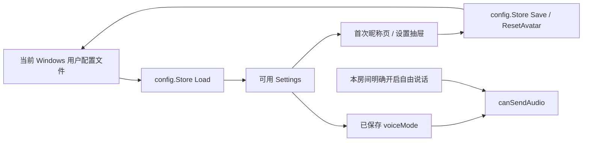

# 本地匿名身份与设置设计

## 1. 设计目的

为桌面端建立一个深的本机设置模块：调用方只读取、保存或重新随机头像；模块内部负责当前用户配置路径、JSON 编解码、默认值、身份/头像生成、字段归一化和损坏配置回退。这样首次昵称页、设置抽屉和后续房间流程不复制持久化或安全规则。

## 2. 约束和不变量

- 设置由 `apps/desktop/internal/config` 的 Go 层拥有，使用当前 Windows 用户应用配置目录；前端不直接读写磁盘。
- `anonymous_id` 与 `avatar_id` 在每一份返回设置中都必须非空；两者仅代表本机匿名身份和随机头像，不是账号、认证信息或云资料。
- 默认 `PushToTalkKey` 为 `V`，`VoiceMode` 为 `push_to_talk`，`OutputVolume` 为 `100`。
- 空设备值表示使用系统默认麦克风/输出设备；本任务不枚举或切换设备。
- 允许重复昵称；昵称输入长度与空值校验属于后续 UI，存储模块不引入账户或唯一性规则。
- `free_talk` 是持久化偏好，而不是本房间授权。新房间在 `freeTalkEnabledInRoom=false` 前绝不发送音频。
- 不持久化房间历史、自动加入、关闭窗口偏好、账号数据或 LiveKit token。

## 3. 模块与接口

### 3.1 Go 存储模块

文件：`apps/desktop/internal/config/store.go`

`Settings` 使用稳定的 snake_case JSON 字段：

```go
type Settings struct {
    AnonymousID      string `json:"anonymous_id"`
    Nickname         string `json:"nickname"`
    AvatarID         string `json:"avatar_id"`
    PushToTalkKey    string `json:"push_to_talk_key"`
    MicrophoneDevice string `json:"microphone_device"`
    OutputDevice     string `json:"output_device"`
    VoiceMode        string `json:"voice_mode"`
    OutputVolume     int    `json:"output_volume"`
}
```

模块应暴露一个由路径构造的 `Store`，并只提供：

- `Load() (Settings, error)`：读取、归一化并返回可用设置；文件缺失或 JSON 损坏时生成安全默认值、生成身份/头像并持久化后返回。
- `Save(Settings) error`：归一化并可靠写入设置。
- `ResetAvatar() (Settings, error)`：加载现有设置，生成新的随机头像，保留其他字段并保存后返回。

测试通过传入临时文件路径构造 Store；生产路径通过 `os.UserConfigDir` 下的 echo 配置目录解析。随机标识由加密安全随机字节编码，不依赖账号服务或全局进程状态。

### 3.2 归一化与恢复

加载后的配置必须经过同一归一化路径：补充缺失身份和头像；空快捷键恢复为 `V`；未知语音模式恢复为 `push_to_talk`；音量限制在 0–100。设备值和昵称原样保留，空设备仍表示系统默认。

若 JSON 无法解析，Store 不能 panic 或将不可用数据交给调用方。它改用新默认设置、生成新匿名身份与头像，并保存这份可用配置。文件系统权限或写入失败仍以 error 返回，因为不存在可保证的持久化状态。

### 3.3 前端合同与语音状态

文件：

- `apps/desktop/frontend/src/settings/settings.ts`
- `apps/desktop/frontend/src/state/voiceState.ts`

`LocalSettings` 以 camelCase 表达与 Go `Settings` 一一对应的前端值；`defaultSettings` 反映 Go 的安全默认值。Wails bridge 的实际调用留给实现房间 UI 的后续任务，避免在当前 spike 界面建立一次性桥接层。

`canSendAudio` 是纯函数。它要求：已连接、麦克风可用且未静音；按键说话还要求 `pttPressed`；自由说话还要求 `freeTalkEnabledInRoom`。保存的 `voiceMode` 只影响模式分支，不能跳过该本房间确认。

## 4. 数据流



首次启动的 `Load` 与损坏配置恢复均遵循同一流：产生设置、持久化、返回。后续界面编辑设置后调用 `Save`；随机头像按钮调用 `ResetAvatar`。进入房间时，保存的偏好进入语音状态，但本房间自由说话许可初始化为 false。

## 5. 测试设计

Go 单元测试覆盖：首次生成与默认值、完整跨 Store 恢复、头像重置且保留其他字段、损坏 JSON 回退、缺失/非法字段归一化。测试使用临时目录，不访问真实用户配置。

Vitest 覆盖：前端默认合同与所有语音状态分支，特别是保存 `free_talk` 而 `freeTalkEnabledInRoom=false` 的拒绝发送路径。真实 WebView2、设备选择和媒体播放不在本任务中；其验证属于后续 Windows HITL 范围。

## 6. 兼容性与回滚

配置格式是新文件，无历史迁移。未知 JSON 字段由 Go 解码忽略，缺失已知字段由归一化填充，因此未来可扩展而不破坏现有本地设置。回滚只需移除新模块和它创建的本机配置文件；无服务端、数据库或网络协议迁移。