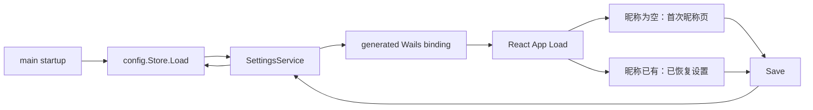

# 本地设置运行时接线设计

## 1. 根因

PR #39 已实现 `config.Store`，但 `main.go` 没有构造它或注册 Wails service，`App.tsx` 也没有调用 Store 能力。`Settings` 因而只是未使用的库：运行客户端不会创建、保存、恢复或重置设置。

## 2. 边界与接口

### 2.1 Go 层

`config.Store` 保持唯一的磁盘 owner：配置路径、JSON、默认值、身份/头像生成、归一化及损坏数据回退均不移出该模块。

新增 `internal/app.SettingsService`。它接受窄 `SettingsStore` seam 并导出：

```go
Load() (config.Settings, error)
Save(config.Settings) (config.Settings, error)
ResetAvatar() (config.Settings, error)
```

`Save` 在 Store 保存后重新读取并返回归一化的真实持久化值。service 不持有第二份设置、不生成默认值、不吞掉错误。

`main.go` 在 `app.Run` 前：创建默认 Store、调用 `Load` 以确保首次身份创建、构造 `SettingsService`，并用 `application.NewService` 注册。无法读写用户配置目录时退出并输出该错误；损坏 JSON 已在 Store 内安全恢复，不会走此错误分支。

### 2.2 Wails binding seam

Wails 生成的 `SettingsService` TypeScript binding 是 Go→React 的唯一 RPC 合同。构建时运行 `wails3 generate bindings -ts -i`，生成文件不手写。前端 adapter 只负责调用生成方法和将服务错误呈现为 UI 状态；不定义独立的八字段 `LocalSettings`，也不复制 Go 默认值。

### 2.3 React 设置界面

`App` 在 mount 时调用生成 binding 的 `Load`：



初始昵称页遵循 UI 规范：显示随机头像、昵称输入与继续按钮；空/超过 16 字符时不可保存。设置 UI 显示并保存快捷键、设备标识、语音模式及整体音量；重置头像只走 ResetAvatar。保存后的 React 状态使用 service 返回值。

在进入真实房间前不存在 `freeTalkEnabledInRoom=true` 的状态；持久化 `free_talk` 仍由既有纯函数要求显式房间内开启。

## 3. 测试与诊断反馈环

主反馈环：

```powershell
cd apps\desktop\frontend
npm run test:run -- src/App.test.tsx
```

修复前该测试必须因 App 只渲染 KeyboardSpike 而失败；修复后它模拟 Wails binding，断言首次昵称屏、边界验证、Save、ResetAvatar 和服务返回状态。Go service 单测使用 fake Store 断言委托与错误传播。最终 `wails3 generate bindings -ts -i`、`wails3 build`、桌面 Go 测试与前端生产构建证明实际 binding seam 可编译。

## 4. 取舍与回滚

不提前实现完整首页、设备枚举或媒体行为；字段输入仅持久化后续设备层提供的标识。删除 `SettingsService`、生成 binding、设置 UI 与相应测试可回滚此接线，已有 Store 文件格式保持兼容。