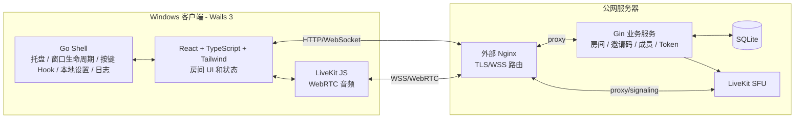

# echo MVP 技术设计

## 1. 目的

本文把 `prd.md`、`CONTEXT.md` 和 `docs/adr/` 中已确认的架构决策整理为 echo v0.1 的技术设计，供后续 `implement.md` 使用。

MVP 必须让 2-10 名 Windows 用户通过邀请码快速进入同一个临时房间，使用 LiveKit/WebRTC 完成语音交流，并在游戏前台时保持按键说话、静音、说话高亮、重连和托盘行为可靠清晰。

## 2. 设计来源

- 产品需求：`prd.md`
- 业务语言：`CONTEXT.md`
- 架构决策：`docs/adr/0001` 至 `docs/adr/0032`

关键已确认决策：

- 语音采用服务端转发，不做纯 P2P。
- 媒体转发采用 SFU 风格，不做服务端房间混音。
- 语音媒体使用 WebRTC / Opus，并通过 LiveKit 承载。
- LiveKit 自托管，只负责媒体房间。
- 业务服务拥有产品房间、邀请码、生命周期、成员和产品状态。
- 桌面壳使用 Wails 3；Electron 不是回退方案。
- 如果 Wails 3 快捷键 API 不能可靠提供 keydown/keyup，则用 Windows native keyboard hook 实现按键说话。
- 音频采集和播放保留在 WebView2 + LiveKit JS 中，不在 Go 层自研第二套音频管线。
- 后端使用 Gin + GORM + SQLite，v0.1 单实例部署。
- 公网部署使用已有外部 Nginx、API/LiveKit 双子域名、Docker Compose 承载业务服务和 LiveKit，默认不启用 TURN。

## 3. 目标

- Windows 10 / Windows 11 x64 桌面应用。
- 本地匿名身份、昵称、随机头像和本地设置。
- 创建临时房间并生成 6 位邀请码。
- 输入归一化邀请码加入房间。
- 每个房间最多 10 名在线或重连中成员。
- 通过 LiveKit WebRTC 音频完成实时语音。
- 支持按键说话和自由说话。
- 静音状态同时影响真实媒体发送和成员列表 UI。
- 成员列表展示房主、“我”、静音、正在说话、重连状态。
- 关闭窗口进入系统托盘，语音不中断。
- 客户端和服务端默认保留详细本地日志，但不自动上传。
- GitHub Actions 构建 Windows 安装包，并上传到 GitHub Releases。

## 4. 非目标

- 账号注册、登录、手机号、邮箱、好友、云端个人资料。
- 固定房间、房间历史、自动加入上次房间、长期邀请码。
- 文字聊天、私聊、视频、屏幕共享、录音、回放、语音历史。
- 房主管理：踢人、转让房主、关闭房间、撤销邀请码。
- 公开社区、举报、封禁、黑名单、商城、插件、会员系统。
- 自动更新、开机启动、绿色版、macOS、Linux、Windows ARM、32 位支持。
- 弱网体验承诺、网络质量评分、多线路切换、默认 TURN。
- 多实例后端、Kubernetes、Redis、分布式锁、托管数据库。

## 5. 总体架构



运行时职责：

- Wails Go shell 负责原生桌面能力。
- React UI 负责页面、设置、房间状态展示和用户交互。
- LiveKit JS 负责浏览器媒体采集/播放和 WebRTC 会话。
- Gin 业务服务负责产品房间权限、生命周期、成员状态和 LiveKit token 签发。
- LiveKit 只负责 SFU 媒体转发。
- SQLite 持久化产品房间生命周期数据。
- 服务端内存状态保存实时连接和短期成员状态。

## 6. 仓库结构

```text
/
├── apps/
│   └── desktop/              # Wails 3 桌面端
│       ├── go.mod
│       ├── frontend/         # React + TypeScript + Vite + Tailwind
│       └── internal/         # Wails Go shell 服务
├── services/
│   └── api/                  # Gin + GORM 业务服务
│       ├── go.mod
│       ├── openapi.yaml
│       └── internal/
├── deploy/
│   └── server/               # Docker Compose、LiveKit 配置、Nginx 示例片段
├── docs/
│   └── adr/
├── go.work
├── CONTEXT.md
├── prd.md
└── design.md
```

约束：

- `apps/desktop` 和 `services/api` 是独立 Go module。
- 根目录 `go.work` 只用于本地协同开发。
- 桌面端不能 import API 服务内部包。
- API 服务不能 import 桌面端内部包。
- 共享包或生成客户端等 API payload 稳定后再考虑，MVP 不预先抽象。

## 7. 桌面端设计

### 7.1 Wails Go shell

职责：

- 创建和管理主窗口。
- 点击关闭按钮时隐藏到系统托盘，不离开房间、不停止语音。
- 托盘菜单：显示主窗口、离开房间、退出 echo。
- 退出应用时：先离开当前房间，再关闭应用。
- 在当前 Windows 用户应用配置目录读写本地设置。
- 记录客户端本地结构化日志。
- 注册全局按键说话快捷键。
- 如果 Wails 3 快捷键 API 不能可靠表达按下/松开，则用 Windows low-level keyboard hook。
- 通过 Wails bridge 把原生事件同步给前端。

Go shell 不负责采集、编码、解码、混音或播放房间语音。

### 7.2 前端

技术栈：

- React
- TypeScript
- Vite
- Tailwind CSS
- LiveKit JS / 必要时使用 LiveKit React SDK

状态策略：

- 先使用 React state、context 和小型自定义 hooks。
- 不预先引入 Redux、Zustand 或其他全局状态库。
- 房间状态流转必须显式、可测试。

核心页面/区域：

- 首次昵称页。
- 首页：创建房间、输入邀请码。
- 创建成功页：邀请码、复制内容、进入房间。
- 房间页：自己语音状态、成员列表、邀请码复制、语音模式、静音、设置、离开。
- 设置页：昵称、随机头像、按键说话快捷键、麦克风设备、输出设备、测试麦克风、整体房间语音音量。
- 关于弹窗：版本、GitHub Releases 新版本渠道、腾讯问卷反馈入口、隐私说明。

### 7.3 本地设置

由 Wails Go 层保存：

- `anonymous_id`
- 昵称
- 随机头像种子或头像 ID
- 按键说话快捷键
- 麦克风设备选择
- 输出设备选择
- 语音模式偏好
- 整体输出音量

不保存：

- 房间历史
- 自动加入上次房间
- 关闭窗口行为偏好
- 账号数据
- LiveKit token

如果用户删除本地设置，下次启动生成新的匿名身份。

## 8. 媒体与音频设计

### 8.1 LiveKit 媒体路径

- 客户端从业务服务拿到短期 LiveKit token 后加入 LiveKit 房间。
- 客户端发布一个本地麦克风音频 track。
- 客户端订阅其他成员的远端音频 track。
- 服务端不做房间混音。
- 客户端负责远端播放和整体房间语音音量。

### 8.2 设备控制

优先路径：

- 麦克风枚举：WebView2 浏览器媒体 API。
- 麦克风切换：LiveKit / 浏览器 media track replacement。
- 输出设备切换：优先使用 WebView2 支持的浏览器能力。
- 输入音量条和测试麦克风：前端分析本地 media stream。

风险：

- 输出设备选择在 WebView2 中可能存在兼容差异，是必做 spike。
- 如果输出设备选择不稳定，必须先明确可接受的产品降级；默认不因此在 Go 层自建第二套音频播放管线。

### 8.3 语音模式

模式：

- 按键说话：首次进入房间默认模式。只有按住快捷键且未静音时发送。
- 自由说话：用户必须在房间内主动开启。未静音时持续发送。

静音优先级：

- 静音始终阻止本地音频发送。
- 取消静音只表示允许按当前语音模式发送。
- 即使保存了自由说话偏好，下次进入房间也不能自动开始发送声音。

## 9. 业务服务设计

技术栈：

- Go
- Gin
- GORM
- SQLite
- WebSocket 库在实现阶段选择
- LiveKit server SDK 用于 token 签发和必要的 participant 管理

主要组件：

- HTTP API handlers
- room manager
- invite code service
- member/session manager
- WebSocket hub
- LiveKit token service
- persistence repository
- cleanup scheduler
- structured logger

### 9.1 产品房间与 LiveKit 房间

产品房间：

- 由业务服务拥有。
- 对应 `CONTEXT.md` 中的“临时房间”。
- 拥有邀请码、生命周期、房主标识、房间名、人数上限、成员和重连语义。

LiveKit 房间：

- 由 LiveKit 拥有。
- 只用于媒体传输。
- 通过服务端生成的名称与产品房间映射。
- 不决定产品房间有效性、邀请码过期或房主权限。

### 9.2 匿名身份

- 客户端首次启动生成 `anonymous_id`。
- 创建或加入房间时提交 `anonymous_id`、昵称和随机头像。
- 服务端只把它用于重连识别和房主标识。
- 服务端不能把它当账号、登录凭证、好友身份或跨设备资料。

### 9.3 成员身份

区分四类身份/令牌：

- `anonymous_id`：客户端本机稳定匿名身份。
- `member_id`：服务端生成的当前房间成员 ID。
- `livekit_identity`：等于或派生自 `member_id`，只在对应 LiveKit 房间内使用。
- `room_session_token`：业务服务签发的短期房间会话 token，用于 WebSocket 授权。

这样可以避免客户端只凭 `anonymous_id` 伪装成已加入成员。

## 10. 持久化模型

SQLite 持久化产品房间生命周期数据。实时连接状态保存在内存。

### 10.1 表

`rooms`：

- `id`
- `name`
- `invite_code`
- `livekit_room_name`
- `host_anonymous_id`
- `host_nickname`
- `host_avatar_id`
- `state`：`active | expired`
- `created_at`
- `last_empty_at`
- `expires_at`
- `updated_at`

索引：

- 邀请码查询索引。
- active 邀请码唯一约束；MVP 实现成全局唯一也可接受，属于更严格约束。
- `expires_at` 清理索引。

可选表：

- 如果结构化日志不足以支持排障，可增加 `room_events` 本地事件表；它不是产品行为必需表。

### 10.2 内存房间状态

每个活跃房间保存：

- room ID
- 在线/重连中成员
- 成员列表顺序
- WebSocket 连接
- 重连截止时间
- 静音状态
- 正在说话状态
- LiveKit participant identity 映射
- 最新状态快照版本

服务重启恢复规则：

- API 服务启动时，内存中没有 live connection。
- 对于数据库中 active 且没有 `expires_at` 的房间，按启动时刻视为空房间，设置或推导 `expires_at = startup_time + 30 分钟`。
- 客户端可在过期前用邀请码重新加入。
- 这是单实例 MVP 在不持久化 live connection 情况下最安全的恢复策略。

## 11. 房间生命周期

### 11.1 创建

1. 客户端发送 `anonymous_id`、昵称、头像和可选房间名。
2. 业务服务校验昵称和房间名。
3. 业务服务生成 6 位 `A-Z0-9` 邀请码。
4. SQLite 唯一约束保护 active 邀请码，冲突时重试。
5. 服务创建产品房间和房主成员。
6. 服务创建或准备 LiveKit 房间名。
7. 服务返回房间快照、邀请码、`member_id`、房间会话 token 和 LiveKit token。

### 11.2 加入

1. 客户端归一化邀请码：去掉空格/短横线，并转大写。
2. 业务服务查找 active 且未过期房间。
3. 无效、过期或满员时返回明确错误。
4. 如果同一 `anonymous_id` 在同一房间 30 秒重连窗口内回来，恢复原成员。
5. 否则在容量允许时新增成员。
6. 返回房间快照、房间会话 token 和 LiveKit token。

### 11.3 离开

1. 客户端通过 HTTP 或 WebSocket 请求离开。
2. 业务服务标记成员离开并广播移除。
3. 如果 LiveKit participant 仍连接，服务可以移除该 participant。
4. 如果房间没有在线/重连中成员，写入 `last_empty_at` 和 `expires_at = now + 30 分钟`。

### 11.4 断线与重连

连接断开时：

- 成员变为 `reconnecting`。
- 保留成员列表位置。
- 保留房间人数名额。
- 清空正在说话状态。
- 启动 30 秒重连窗口。

同一 `anonymous_id + room_id` 在 30 秒内重连：

- 恢复同一个 `member_id`。
- 保留列表顺序。
- 签发新的 LiveKit token。
- 状态回到 `online`。

超过 30 秒：

- 成员标记为 disconnected。
- 从在线列表移除。
- 释放房间名额。
- 如果房间变空，启动 30 分钟保留计时。

### 11.5 过期

- 空房间在最后成员离开或重连失败 30 分钟后过期。
- 过期前有人重新加入，清空空房计时，房间恢复有效。
- 过期后加入，返回房间已过期，邀请码不可再用。
- 清理任务定期标记过期房间，后续可再做物理删除。

## 12. 邀请码规则

- 字符集：`A-Z` 和 `0-9`。
- 长度：6。
- 只由业务服务生成。
- 用户输入大小写不敏感。
- 用户输入忽略空格和短横线。
- 过期房间的邀请码不可再用。
- MVP 不做自定义邀请码、长期邀请码、房间密码。

## 13. HTTP API 契约

`services/api/openapi.yaml` 是 HTTP API 的唯一契约来源。

初始端点：

- `GET /healthz`
- `POST /v1/rooms`
  - 创建房间
  - 返回房间快照、邀请码、member ID、房间会话 token、LiveKit token
- `POST /v1/rooms/join`
  - 通过邀请码加入房间
  - 返回房间快照、member ID、房间会话 token、LiveKit token
- `GET /v1/rooms/{room_id}`
  - 用已授权房间会话获取当前房间快照
- `POST /v1/rooms/{room_id}/leave`
  - 离开当前房间
- `POST /v1/rooms/{room_id}/livekit-token`
  - 为重连或媒体恢复签发新的 LiveKit token

具体 request/response schema 写入 `openapi.yaml`，不要只散落在代码中。

## 14. WebSocket 契约

WebSocket 消息单独维护，例如 `docs/api/websocket.md`。

连接：

- `GET /v1/rooms/{room_id}/ws`
- 使用业务服务签发的房间会话 token 授权。
- 同一 `member_id` 优先只保留一个活跃连接；新连接可替换旧的僵尸连接。

服务端到客户端消息：

- `room.snapshot`
- `member.joined`
- `member.left`
- `member.reconnecting`
- `member.disconnected`
- `member.restored`
- `member.muted_changed`
- `member.speaking_changed`
- `room.expired`
- `room.error`
- `room.resync_required`
- `heartbeat.ping`

客户端到服务端消息：

- `heartbeat.pong`
- `member.mute_changed`
- `member.speaking_changed`
- `member.voice_mode_changed`
- `member.leave_requested`
- `room.resync_requested`

规则：

- speaking 变化必须节流，避免事件风暴。
- 服务端对成员身份、房间容量和房间生命周期保持权威。
- 客户端可以乐观更新自己的 UI，但必须用服务端事件对齐。
- 未知消息类型应记录日志并忽略，不应导致应用崩溃。

## 15. LiveKit 集成

业务服务：

- 保存 LiveKit API key 和 secret。
- 在产品房间校验通过后签发 LiveKit token。
- token 默认有效期 10 分钟。
- token 只允许加入对应 LiveKit room 和 participant identity。
- token 签发结果写日志，但不记录 token 明文。

客户端：

- 从业务服务拿到 LiveKit URL 和 token。
- 产品房间 create/join 成功后加入 LiveKit 房间。
- 根据本地语音状态发布麦克风音频。
- 订阅其他成员音频。
- 媒体重连需要时重新向业务服务申请 token。

部署：

- LiveKit 运行在公网服务器。
- v0.1 默认不部署 TURN/coturn。
- WebRTC 正常 ICE/STUN 行为保留。
- 如果朋友内测发现特定 NAT、防火墙或 UDP 受限网络无法建立媒体连接，再新增 TURN。

## 16. 语音状态模型

输入：

- `voice_mode`：`push_to_talk | free_talk`
- `muted`：boolean
- `ptt_pressed`：boolean
- `mic_available`：boolean
- `connected`：产品连接和媒体连接均可用

本地发送状态：

```text
can_send = connected && mic_available && !muted && (
  (voice_mode == push_to_talk && ptt_pressed) ||
  (voice_mode == free_talk && user_enabled_free_talk_in_room)
)
```

规则：

- 首次进入房间默认按键说话。
- 保存的自由说话偏好不能让下次进房自动发声。
- 静音优先级高于所有语音模式。
- 重连中始终停止发送。

## 17. 静音与正在说话状态

### 17.1 静音

用户切换静音时：

1. 客户端立即更新本地 LiveKit audio track mute 状态。
2. 客户端通过 WebSocket 上报静音状态。
3. 业务服务广播静音状态。
4. 房间 UI 显示成员静音图标。

### 17.2 正在说话

正在说话是产品 UI 信号，不是计费或权限信号。

- 客户端根据语音模式、静音状态、按键状态、本地麦克风输入判断自己是否正在说话。
- 客户端通过 WebSocket 上报 `speaking=true/false`。
- 业务服务节流并广播 speaking 变化。
- 其他客户端高亮正在说话成员。
- 停止说话后高亮可保留约 1 秒，避免短句闪烁。

## 18. 桌面生命周期

关闭主窗口：

- 隐藏到系统托盘。
- 应用继续运行。
- 房间和语音连接继续保持。
- 如可行，在托盘中展示轻量状态。

托盘菜单：

- 显示主窗口。
- 离开房间。
- 退出 echo。

退出：

- 如果在房间内，先离开房间。
- 停止 LiveKit 媒体。
- 关闭 WebSocket。
- flush 日志。
- 退出应用。

## 19. 日志与诊断

### 19.1 客户端日志

客户端本机保存详细结构化日志：

- 应用启动/退出
- Wails 生命周期事件
- 托盘行为
- 按键注册
- 按键说话按下/松开状态
- 设备枚举和切换
- LiveKit 连接状态
- WebSocket 连接状态
- 房间操作失败原因
- 未捕获错误摘要

不记录：

- 语音内容
- 音频数据
- 长期明文邀请码历史
- LiveKit token 明文
- 敏感请求体

### 19.2 服务端日志

服务端机器保存详细结构化日志：

- HTTP 请求摘要
- 房间创建/加入/离开
- 邀请码校验结果
- 人数上限检查
- 房间过期与清理
- WebSocket 连接/断开
- 重连窗口开始/恢复/过期
- LiveKit token 签发结果
- LiveKit API 调用结果
- SQLite 错误

不记录：

- 语音内容
- 音频数据
- LiveKit token 明文
- 敏感请求体

### 19.3 上传策略

- 日志不会自动上传。
- 腾讯问卷不会自动附带日志。
- 排障通过用户手动导出、截图或复制错误信息完成。
- 日志应按时间和大小滚动；建议默认 14 天或每进程 100 MB，除非实现约束要求更小。

## 20. 部署设计

### 20.1 公网服务器

单台公网服务器运行：

- business service container
- LiveKit container
- SQLite 持久化 volume 或宿主机目录
- 服务端日志目录

Compose 外部已有：

- Nginx
- TLS 证书
- 公网域名路由

### 20.2 域名

使用两个子域名：

- `api.<domain>` -> Gin 业务服务 HTTP/WebSocket
- `livekit.<domain>` -> LiveKit WSS/signaling

Nginx 必须为 WSS upstream 保留 WebSocket Upgrade 行为。

### 20.3 Docker Compose

`deploy/server` 应包含：

- `docker-compose.yml`
- 业务服务环境变量示例
- LiveKit 配置示例
- 外部 Nginx 参考片段
- 持久化目录说明

v0.1 不使用 Kubernetes、Redis、托管数据库或多节点 LiveKit。

## 21. 发布设计

版本：

- 应用版本：`0.1.0`
- Git tag：`v0.1.0`
- Release 标题：`echo v0.1.0`
- 安装包文件名：`echo-0.1.0-windows-x64.<ext>`
- 关于弹窗：`echo 0.1.0 / 朋友内测版`

构建和分发：

- GitHub Actions 构建 Windows x64 installer。
- 不锁定 installer 格式，优先使用 Wails 支持的最少定制输出。
- GitHub Releases 承载安装包。
- 不做自动更新。
- 阻断问题通过原分发渠道通知用户下载新版。

## 22. 必做技术 spike

完整实现前必须先验证：

1. Wails 3 + WebView2 可以运行 LiveKit JS，并完成加入、发布、订阅音频。
2. WebView2 可以枚举和切换麦克风设备。
3. 输出设备选择可稳定工作，或先明确可接受的产品降级。
4. 应用隐藏到托盘后 LiveKit 语音不中断。
5. 游戏在前台时，按键说话的按下/松开可靠。
6. 如果 Wails 快捷键 API 不够，Windows low-level keyboard hook 可工作并能把状态桥接到前端。
7. 公网单节点 LiveKit 可经由已有 Nginx、双子域名正常连接。
8. GitHub Actions 能构建 Windows x64 安装包并上传 GitHub Release。

## 23. 测试策略

### 23.1 后端自动测试

覆盖：

- 邀请码归一化
- 邀请码冲突重试
- 房间创建
- 房间加入
- 无效/过期邀请码
- 10 人上限
- 30 秒重连窗口
- 30 分钟空房保留
- 服务重启后的房间恢复行为
- LiveKit token scope 和过期元数据
- SQLite 持久化和清理

### 23.2 前端/客户端自动测试

覆盖：

- 本地设置读写逻辑
- 语音模式状态推导
- 静音优先级
- 按键说话按下/松开状态处理
- WebSocket reducer / event application
- 成员列表排序
- 正在说话高亮延迟消失
- 错误状态展示

### 23.3 手工验收

必须在 Windows 10/11 x64 验证：

- 两人进房并双向语音
- 3-10 人房间
- 第 11 人加入失败
- 麦克风切换
- 输出设备切换或已接受的降级行为
- 测试麦克风输入条
- 游戏前台时按键说话
- 自由说话必须由用户在房间内主动开启
- 静音阻止发声
- 关闭窗口进入托盘后语音不中断
- 30 秒内重连恢复
- 超过 30 秒重连失败
- 空房 30 分钟后房间过期
- GitHub Releases 安装包可安装和启动

游戏场景覆盖：

- 前台独占 / 全屏游戏
- 无边框窗口游戏
- 管理员权限运行的游戏
- 带反作弊或限制全局快捷键的游戏
- 普通桌面场景，用于排除非游戏问题

## 24. 安全与隐私边界

- 不做账号和云端个人资料。
- 匿名身份仅保存在本机，不可恢复、不同步。
- 房间会话 token 证明用户已成功加入，用于 WebSocket 授权。
- LiveKit token 短期有效，不长期保存。
- 公网 endpoint 必须使用 HTTPS/WSS。
- 日志详细，但只本地保存和手动导出。
- 不录制、不保存语音内容和音频数据。
- 腾讯问卷是外部反馈入口；应用内不提交反馈表单。

## 25. 实现准备状态

本文已可进入 `implement.md`。实现计划应从技术 spike 开始，因为 Wails 3 + WebView2 + LiveKit + 按键说话是最高风险假设。
