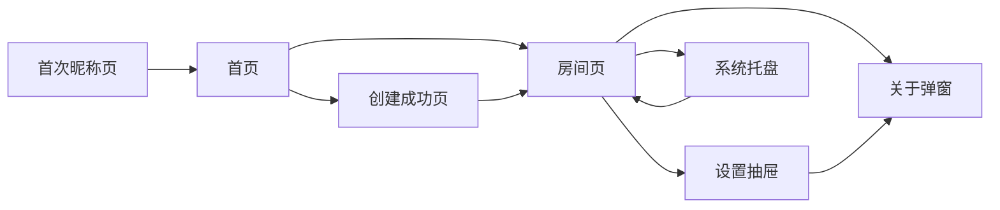

# echo PC 客户端 UI 规范

## 1. 目的

本文基于 `artifacts/echo-client-prototype-v4-cn.png`，把 echo v0.1 PC 客户端原型沉淀为可实现的 UI 规范。图片用于视觉方向参考；本文是实现时的界面结构、状态、组件和文案来源。

适用范围：

- Wails 3 Windows 桌面客户端
- React / TypeScript / Tailwind CSS 前端
- v0.1 / MVP / 朋友内测版

不适用范围：

- 移动端
- 网页端完整体验
- 管理后台
- 营销官网

## 2. 设计方向

### 2.1 Design Read

面向 PC 游戏玩家的轻量语音工具，采用浅色冷感消费级界面语言，接近现代游戏外设控制台和轻量音频控制台的结合。

关键词：

```text
冷白
银灰
石墨文字
单一钴蓝强调
哑光表面
精密发丝线
音频控制台
低打扰
轻量
非企业风
```

### 2.2 必须避免

```text
企业 SaaS 风
聊天软件风
Discord 平替感
紫色或蓝紫色发光
大面积渐变
玻璃拟态
三等分功能卡片
最近房间历史
文字聊天区域
复杂仪表盘
浮夸游戏 HUD
```

### 2.3 设计原则

1. 房间页优先级最高：自己的语音状态、连接状态、按键说话状态、成员列表、静音入口、离开房间入口、设置入口必须一眼可见。
2. 轻量优先：设置、关于、反馈不抢主界面注意力。
3. 状态可信：连接、静音、正在说话、重连、输入音量必须比装饰元素更醒目。
4. 不用房间历史：MVP 不展示最近房间，不自动加入上次房间。
5. 中文短文案：按钮和标签优先使用 2-6 个汉字，避免长句挤压控件。
6. 单一强调色：钴蓝只用于主操作、选中态、关键输入焦点和局部音量轨道。

## 3. 信息架构

### 3.1 顶层界面

```text
首次昵称页
首页
创建成功页
房间页
设置抽屉
关于弹窗
轻提示
系统托盘菜单
```

v4 原型展示了三类核心界面：

```text
首页
房间页
设置抽屉
```

实现时还必须补齐：

```text
首次昵称页
创建成功页
关于弹窗
错误和空状态
托盘菜单
```

### 3.2 页面关系



## 4. 视觉系统

### 4.1 颜色 token

| Token | 值 | 用途 |
| --- | --- | --- |
| `--color-app-bg` | `#F3F6F8` | 应用背景和画布 |
| `--color-window` | `#F8FAFB` | 主窗口底色 |
| `--color-surface` | `#FFFFFF` | 输入框、列表行、弹层 |
| `--color-surface-muted` | `#EEF2F5` | 次级区域、禁用背景 |
| `--color-surface-pressed` | `#E7ECF1` | 按下态 |
| `--color-border` | `#D7DEE5` | 默认边框 |
| `--color-border-strong` | `#B9C4CE` | 窗口边框、焦点外边界 |
| `--color-text` | `#1F2933` | 主文字 |
| `--color-text-muted` | `#647282` | 次级文字 |
| `--color-text-subtle` | `#8B97A4` | 辅助说明 |
| `--color-accent` | `#0B63F6` | 主按钮、选中态、焦点 |
| `--color-accent-hover` | `#0757D5` | 主按钮 hover |
| `--color-accent-pressed` | `#0649B4` | 主按钮 pressed |
| `--color-accent-soft` | `#E8F0FF` | 轻选中背景 |
| `--color-connected` | `#128A3D` | 已连接、正在说话 |
| `--color-reconnecting` | `#C47A00` | 重连中 |
| `--color-muted` | `#98A3AF` | 静音、禁用音量 |
| `--color-danger` | `#B42318` | 连接失败、退出确认 |
| `--color-focus-ring` | `#73A7FF` | 键盘焦点 |

规则：

- 不使用大面积渐变。
- 不使用紫色、粉色、霓虹外发光作为品牌色。
- 绿色和橙色只用于语义状态，不作为品牌强调色。
- 所有边框优先使用 1px 发丝线。

### 4.2 字体

推荐字体栈：

```css
font-family:
  "HarmonyOS Sans SC",
  "MiSans",
  "Microsoft YaHei UI",
  "Segoe UI",
  sans-serif;
```

实现要求：

- 如果项目能合法自带字体，优先随包提供 `HarmonyOS Sans SC` 或 `MiSans`。
- 如果不随包提供字体，使用 Windows 默认中文字体回退。
- 数字、邀请码、快捷键、延迟值使用 tabular numbers。

字号 token：

| Token | 大小 | 行高 | 用途 |
| --- | --- | --- | --- |
| `text-display` | 28px | 36px | 重要房间名或欢迎标题 |
| `text-title` | 20px | 28px | 窗口标题、用户昵称 |
| `text-body` | 14px | 22px | 默认正文 |
| `text-label` | 12px | 18px | 表单标签、表头 |
| `text-caption` | 11px | 16px | 辅助说明、状态说明 |
| `text-code` | 13px | 20px | 邀请码、快捷键 |

字重：

```text
普通正文：400
按钮和标签：500
标题和成员昵称：600
品牌 echo：700
```

### 4.3 间距

使用 4px 网格：

| Token | 值 | 用途 |
| --- | --- | --- |
| `space-1` | 4px | 图标与文字小间距 |
| `space-2` | 8px | 紧凑控件内距 |
| `space-3` | 12px | 表单项间距 |
| `space-4` | 16px | 卡片内距 |
| `space-5` | 20px | 区块内距 |
| `space-6` | 24px | 主区块间距 |
| `space-8` | 32px | 页面大间距 |

### 4.4 圆角和边框

| Token | 值 | 用途 |
| --- | --- | --- |
| `radius-xs` | 4px | 邀请码单格、标签 |
| `radius-sm` | 8px | 输入框、按钮、分段控件 |
| `radius-md` | 12px | 成员行、设置区块 |
| `radius-lg` | 16px | 主窗口、抽屉、卡片容器 |

规则：

- 窗口和大容器使用 `radius-lg`。
- 按钮、输入框、选择器使用 `radius-sm`。
- 标签使用 `radius-xs`。
- 不混用全圆 pill 风格。

### 4.5 阴影

只用轻阴影表达层级：

| Token | 值 | 用途 |
| --- | --- | --- |
| `shadow-window` | `0 18px 48px rgb(31 41 51 / 0.10)` | 主窗口 |
| `shadow-popover` | `0 12px 32px rgb(31 41 51 / 0.14)` | 抽屉、弹窗 |
| `shadow-control` | `0 1px 2px rgb(31 41 51 / 0.08)` | 按钮、输入框 |

不使用纯黑重投影。

## 5. 窗口和布局

### 5.1 推荐窗口尺寸

| 窗口 | 推荐尺寸 | 最小尺寸 | 说明 |
| --- | --- | --- | --- |
| 首页 | 360 x 640 | 320 x 560 | 独立紧凑窗口 |
| 房间页 | 880 x 640 | 760 x 560 | 主使用窗口 |
| 设置抽屉 | 320 x 640 | 300 x 560 | 从房间页右侧滑出 |
| 关于弹窗 | 420 x auto | 360 x auto | 居中弹窗 |

v0.1 主要面向 Windows 桌面，不需要移动端布局，但窗口缩小时必须保持内容可用。

### 5.2 标题栏

内容：

```text
echo wordmark
当前区域标题或房间名
最小化
最大化或还原
关闭
```

规则：

- 关闭按钮执行“隐藏到系统托盘”，不是离开房间。
- 真正退出只出现在托盘菜单和应用菜单中。
- 标题栏高度：56px。
- 标题栏底部使用 1px 边线。

### 5.3 首页布局

结构：

```text
标题栏
头像和昵称区域
邀请码输入
加入房间按钮
创建房间按钮
房间名可选输入
轻提示区域
设置入口
```

布局规则：

- 首页窗口宽度保持紧凑，不做宽屏大面板。
- 邀请码输入优先展示为 6 个单格，提高“短码”识别。
- 加入房间按钮在输入邀请码后作为主操作。
- 创建房间按钮为次级操作，但不能弱到找不到。
- 不展示最近房间。
- 不展示自动加入上次房间。

首页轻提示文案：

```text
创建一个临时房间，或输入邀请码加入。
```

### 5.4 房间页布局

房间页分为 5 个区域：

```text
标题栏和房间信息
我的语音控制条
成员列表
底部房间音量和离开操作
设置抽屉入口
```

#### 标题栏和房间信息

内容：

```text
echo
语音房间
房间名
邀请码
复制按钮
连接状态
设置按钮
窗口控制
```

显示示例：

```text
echo | 语音房间 | Alpha 小队 | 7K9L3M | 复制 | 已连接
```

规则：

- 邀请码使用等宽数字字形。
- 复制成功给轻提示，不弹系统通知。
- 连接状态始终可见。

#### 我的语音控制条

内容：

```text
随机头像
“你”标签
昵称
按键说话快捷键
语音模式分段控件
静音按钮
输入音量条
```

规则：

- “我的状态”必须视觉上独立于成员列表。
- 按键说话默认选中。
- 自由说话开启时必须显著提示朋友可以听到麦克风声音。
- 静音按钮必须比普通设置按钮更容易识别。

#### 成员列表

表头：

```text
成员 6 / 10
状态
音量
```

成员行内容：

```text
随机头像
昵称
房主标签
你标签
状态文字
音量或静音状态
```

排序：

1. “我”的状态固定在顶部控制条，不参与普通成员排序。
2. 其他成员按加入房间时间稳定排序。
3. 正在说话只高亮当前行，不移动行位置。
4. 重连中成员保留原位置。

边界：

- MVP 不支持单人成员音量。v4 图片里的每行音量滑杆只作为视觉参考，正式实现应替换为只读状态或去掉，除非未来版本加入单人成员音量。
- MVP 不支持本地静音某个成员。
- MVP 不支持房主踢人。

推荐正式成员行：

```text
头像 + 昵称 + 标签 | 状态 | 静音/输入状态图标
```

不要实现：

```text
每个成员独立音量滑杆
成员右侧三点管理菜单
踢人入口
私聊入口
```

#### 底部操作区

内容：

```text
整体房间音量
离开房间
设置抽屉入口
按 V 说话提示
```

规则：

- 整体房间音量影响所有远端语音总音量。
- 离开房间需要轻确认。
- 设置抽屉入口保留在右下或标题栏齿轮，不能同时出现多个入口造成困惑。

### 5.5 设置抽屉布局

设置抽屉从房间页右侧展开，宽度 320px。

内容顺序：

```text
设置标题
麦克风
输入测试
输出设备
房间音量
快捷键
反馈与关于
```

规则：

- 设置是次级层，不抢房间页主视觉。
- 抽屉打开时房间语音不中断。
- 抽屉不遮挡“离开房间”按钮时更好；如果空间不足，可以覆盖右侧区域。
- 抽屉关闭后设置立即保留。

## 6. 核心组件规范

### 6.1 Button

类型：

| 类型 | 用途 | 样式 |
| --- | --- | --- |
| Primary | 加入房间、确认进入 | 钴蓝背景，白字 |
| Secondary | 创建房间、修改 | 白底，边框，石墨字 |
| Ghost | 返回、关闭抽屉 | 透明背景，hover 灰底 |
| Danger | 确认离开房间 | 白底红字或红色轻背景 |

尺寸：

```text
默认高度：40px
紧凑高度：32px
最小点击区域：32 x 32px
主按钮圆角：8px
```

交互：

```text
hover：背景略加深
active：向下移动 1px 或轻微压暗
focus-visible：2px 钴蓝焦点环
loading：按钮文字保持，右侧或左侧出现小型进度点
```

### 6.2 Input

适用：昵称、房间名。

规则：

- 标签在输入框上方。
- 不用占位提示代替可见标签。
- 错误信息出现在输入框下方。
- 输入框高度 40px。
- 字号 14px。
- focus 时边框使用钴蓝。

### 6.3 InviteCodeInput

邀请码输入使用 6 个单格。

规则：

```text
每格宽 40px
每格高 40px
间距 6px
字母自动转大写
忽略空格和短横线
粘贴完整邀请码时自动分配到 6 格
错误时整组边框标红，不单独标红某一格
```

状态：

```text
空：显示 6 个空格，不显示占位字母
输入中：当前格 focus ring
完整：加入房间按钮可用
格式错误：显示“邀请码应为 6 位字母或数字”
```

### 6.4 SegmentedControl

用于语音模式切换。

选项：

```text
按键说话
自由说话
```

规则：

- 默认选中按键说话。
- 选中项使用钴蓝背景和白字。
- 未选中项白底和边框。
- 切换到自由说话时出现轻提示：`自由说话已开启，朋友可以听到你的麦克风声音。`
- 重新进入房间时即使偏好自由说话，也不能自动开麦。

### 6.5 MuteButton

状态：

| 状态 | 文案 | 图标 | 颜色 |
| --- | --- | --- | --- |
| 未静音 | 静音 | 麦克风 | 默认 |
| 已静音 | 已静音 | 麦克风关闭 | 灰色或浅红提示 |
| 不可用 | 麦克风不可用 | 麦克风关闭 | 灰色禁用 |

规则：

- 静音是覆盖状态，优先级高于按键说话和自由说话。
- 取消静音只恢复当前语音模式，不自动改变模式。

### 6.6 LevelMeter

用于输入音量和正在说话反馈。

形态：

```text
16-24 根竖条
条宽 3px
条间距 3px
圆角 2px
```

颜色：

```text
无输入：灰色
有输入但未达说话阈值：钴蓝
正在说话：绿色
设备不可用：灰色禁用
```

规则：

- 输入音量条反映本地麦克风输入。
- “正在说话”不是麦克风通道打开，而是检测到有效语音输入。
- 成员停止说话后，高亮可保留约 1 秒。

### 6.7 MemberRow

正式实现字段：

```ts
memberId
nickname
avatarId
isSelf
isHost
isMuted
isSpeaking
connectionState
joinedAt
```

视觉：

- 行高：64px。
- 头像：40px。
- 当前说话：左侧钴蓝或绿色 3px 竖线 + 状态文字绿色。
- 房主标签：小边框标签，文案 `房主`。
- 自己标签：钴蓝小标签，文案 `你`。
- 静音：灰色麦克风关闭图标 + `静音`。
- 重连中：橙色状态点或旋转图标 + `重连中`。

不得出现：

```text
成员私聊按钮
踢出成员按钮
每人音量滑杆
本地静音某成员
```

### 6.8 Slider

用途：整体房间音量。

规则：

- 轨道高 4px。
- 已填充轨道使用钴蓝。
- 未填充轨道使用 `--color-border`。
- thumb 直径 16px。
- 键盘可操作。
- 数值范围 0-100。

### 6.9 Select

用途：麦克风和输出设备。

规则：

- 高度 44px。
- 左侧可放设备图标。
- 设备名过长时中间截断。
- 无可用设备时显示禁用态和说明。

### 6.10 Toast

用途：轻量应用内视觉提示。

场景：

```text
复制邀请码成功
复制邀请码失败
成员加入
成员离开
连接异常
重连成功
进入系统托盘
设备切换成功
设备切换失败
```

规则：

- 不播放提示音。
- 不弹 Windows 桌面通知。
- 位置：窗口右下角或顶部居中。
- 默认 2.4 秒后消失。
- 错误提示必须可读，不能瞬间消失。

## 7. 页面规范

### 7.1 首次昵称页

触发条件：本地没有昵称。

内容：

```text
echo
随机头像
昵称输入
继续按钮
```

验收：

- 昵称为空时不能继续。
- 昵称最多 16 个字符。
- 首次保存后生成随机头像和匿名身份。
- 再次启动直接进入首页。

### 7.2 首页

默认状态：

```text
昵称已存在
显示随机头像
邀请码为空
加入房间按钮禁用或低可用态
创建房间按钮可用
房间名可选
无最近房间区域
```

输入邀请码后：

```text
6 位有效格式：加入房间按钮启用
格式错误：输入框下方显示错误
```

创建房间：

- 用户可直接点击创建房间。
- 房间名为空时服务生成默认房间名或使用昵称的小队名，具体由产品/实现决定。
- 创建成功后进入创建成功页，不直接跳过邀请码展示。

### 7.3 创建成功页

内容：

```text
房间名
邀请码
复制邀请按钮
进入房间按钮
返回首页
```

复制邀请文案：

```text
加入我的语音房间，邀请码：7K9L3M
请打开 echo 应用后输入邀请码加入。
```

复制成功提示：

```text
邀请码已复制
```

### 7.4 房间页

必须优先展示：

```text
自己的语音状态
连接状态
按键说话状态
成员列表
静音入口
离开房间入口
设置入口
```

不优先展示：

```text
关于信息
反馈入口
版本信息
设备长列表
```

房间页初始连接状态：

```text
连接中
```

连接成功：

```text
已连接
```

连接失败：

```text
连接失败，请检查网络后重试
操作：重试 / 离开房间
```

### 7.5 设置抽屉

分组：

1. 麦克风
2. 输入测试
3. 输出设备
4. 房间音量
5. 快捷键
6. 反馈与关于

设备不可用状态：

```text
未检测到可用麦克风
无法使用麦克风，请检查系统权限
输出设备不可用，可能无法听到语音
```

操作：

```text
打开设置
仅收听进入
继续进入房间
```

### 7.6 关于弹窗

内容：

```text
产品名称：echo
当前版本号
当前阶段：朋友内测版
腾讯问卷反馈入口
轻量隐私说明
GitHub Releases 新版本下载渠道说明
```

隐私说明短文案：

```text
echo 无需注册账号或手机号。
匿名身份只保存在本机。
不会录制或保存语音内容。
日志只保存在本机或服务端本机，不会自动上传。
反馈问题会打开外部腾讯问卷。
```

## 8. 状态规范

### 8.1 连接状态

| 状态 | 文案 | 颜色 | 用户可操作 |
| --- | --- | --- | --- |
| `connecting` | 连接中 | 灰色 | 等待 |
| `connected` | 已连接 | 绿色 | 正常使用 |
| `reconnecting` | 重连中 | 橙色 | 等待 / 离开房间 |
| `failed` | 连接失败 | 红色 | 重试 / 离开房间 |
| `disconnected` | 已断开 | 灰色 | 重试 / 离开房间 |

规则：

- 重连中必须停止发送语音。
- 30 秒内重连成功恢复原成员状态。
- 30 秒失败后进入连接失败。

### 8.2 语音发送状态

发送声音必须同时满足：

```text
未静音
已连接
设备可用
当前语音模式的发送条件成立
```

状态组合：

| 模式 | 静音 | 按键 | 发送 |
| --- | --- | --- | --- |
| 按键说话 | 否 | 按下 | 是 |
| 按键说话 | 否 | 松开 | 否 |
| 按键说话 | 是 | 按下 | 否 |
| 自由说话 | 否 | 无需按键 | 是 |
| 自由说话 | 是 | 无需按键 | 否 |

### 8.3 成员状态

| 状态 | 显示 |
| --- | --- |
| 普通在线 | 已连接 |
| 正在说话 | 正在说话 + 行高亮 |
| 自己静音 | 静音 |
| 重连中 | 重连中 |
| 连接异常 | 连接异常 |

规则：

- 正在说话不改变排序。
- 重连中不改变排序。
- 房主只是身份标识，不提供管理动作。

## 9. 中文文案规范

### 9.1 固定文案

| 场景 | 文案 |
| --- | --- |
| 产品名 | echo |
| 首页提示 | 创建一个临时房间，或输入邀请码加入。 |
| 昵称 label | 昵称 |
| 邀请码 label | 邀请码 |
| 加入按钮 | 加入房间 |
| 创建按钮 | 创建房间 |
| 房间名 label | 房间名（可选） |
| 复制按钮 | 复制 |
| 连接成功 | 已连接 |
| 连接中 | 连接中 |
| 重连中 | 重连中 |
| 连接失败 | 连接失败 |
| 离开按钮 | 离开房间 |
| 设置标题 | 设置 |
| 麦克风 label | 麦克风 |
| 输出设备 label | 输出设备 |
| 输入测试 | 输入测试 |
| 输入正常 | 输入正常 |
| 房间音量 | 房间音量 |
| 快捷键 | 快捷键 |
| 修改按钮 | 修改 |
| 反馈入口 | 反馈与关于 |

### 9.2 错误文案

| 场景 | 文案 | 操作 |
| --- | --- | --- |
| 昵称为空 | 请输入昵称 | 回到昵称输入 |
| 昵称太长 | 昵称最多 16 个字符 | 修改昵称 |
| 房间名太长 | 房间名称最多 24 个字符 | 修改房间名 |
| 邀请码为空 | 请输入邀请码 | 输入邀请码 |
| 邀请码格式错误 | 邀请码应为 6 位字母或数字 | 重新输入 |
| 邀请码无效 | 邀请码无效，请检查后重试 | 重新输入 / 返回首页 |
| 房间过期 | 该房间已过期，请让朋友重新创建 | 返回首页 / 创建新房间 |
| 房间人数满 | 房间人数已满，暂时无法加入 | 返回首页 / 重试 |
| 麦克风不可用 | 未检测到可用麦克风 | 打开设置 / 仅收听进入 |
| 输出设备不可用 | 输出设备不可用，可能无法听到语音 | 打开设置 / 继续进入房间 |

### 9.3 文案禁用项

```text
最近房间
历史房间
自动加入上次房间
好友
服务器
频道
房间密码
管理员
群主
聊天
私聊
语音激活
自动开麦
```

## 10. 交互规范

### 10.1 键盘

- Tab 顺序必须符合视觉顺序。
- 所有按钮和输入可用键盘操作。
- 邀请码输入支持粘贴完整邀请码。
- 按键说话快捷键设置不能吞掉系统危险按键。
- 禁止设置：Esc、Win、Alt+F4、鼠标左键、鼠标右键、Enter。

### 10.2 焦点

- 所有可交互元素必须有 `focus-visible`。
- 焦点环颜色使用 `--color-focus-ring`。
- 不允许移除 outline 后没有替代样式。

### 10.3 动效

动效强度：低到中。

允许：

```text
按钮 hover / active
抽屉滑入滑出
轻提示淡入淡出
说话状态 1 秒保留
输入音量条实时变化
```

不允许：

```text
页面大幅滚动动画
霓虹闪烁
粒子特效
无限循环装饰动画
音量条过度弹跳
```

所有动效必须尊重 `prefers-reduced-motion`。

### 10.4 托盘

托盘菜单：

```text
显示主窗口
离开房间
退出 echo
```

规则：

- 点击窗口 X：隐藏到托盘，不离开房间。
- 退出 echo：退出前自动离开当前房间。
- 进入托盘给应用内轻提示，不弹 Windows 通知。

## 11. 可访问性

必须满足：

- 所有 icon-only button 有 `aria-label`。
- 表单控件有可见 label。
- 输入错误使用 inline error，并可被读屏读取。
- 连接状态和重连状态用 `aria-live="polite"`。
- 按键说话状态变化不应造成读屏高频刷屏。
- 颜色不能作为唯一状态表达，状态必须有文字或图标。
- 主按钮文字对背景满足 WCAG AA。
- 中文字号不小于 11px。

## 12. 实现建议

### 12.1 组件目录建议

```text
src/components/window/AppWindow.tsx
src/components/window/TitleBar.tsx
src/components/home/HomeView.tsx
src/components/home/InviteCodeInput.tsx
src/components/room/RoomView.tsx
src/components/room/MyVoicePanel.tsx
src/components/room/MemberList.tsx
src/components/room/MemberRow.tsx
src/components/room/ConnectionStatus.tsx
src/components/settings/SettingsDrawer.tsx
src/components/settings/DeviceSelect.tsx
src/components/settings/LevelMeter.tsx
src/components/common/Button.tsx
src/components/common/SegmentedControl.tsx
src/components/common/Slider.tsx
src/components/common/Toast.tsx
```

### 12.2 状态测试重点

- 邀请码归一化和错误显示。
- 首次昵称保存和再次启动恢复。
- 房间状态 reducer 处理快照、成员加入、成员离开、静音、正在说话、重连。
- 语音模式和静音优先级组合。
- 设置抽屉设备选择和本地保存。
- 连接失败、重连中、断开后的 UI 状态。

### 12.3 与 v4 图片的差异修正

v4 图片中有两个视觉点不得直接照搬：

1. 成员行右侧出现类似每人音量滑杆。MVP 不支持单人成员音量，正式 UI 不应实现该控件。
2. 成员行右侧出现三点菜单。MVP 不支持房主管理、私聊或成员操作，正式 UI 不应展示三点菜单。

正式 UI 应保留 v4 的风格、密度、颜色和整体布局，但按 PRD 修正这些功能边界。

## 13. 设计验收清单

- [ ] 首页没有最近房间、房间历史或自动加入上次房间。
- [ ] 首页可以设置昵称、输入邀请码、创建临时房间。
- [ ] 邀请码输入支持 6 位字母数字短码。
- [ ] 房间页优先展示自己的语音状态、连接状态、按键说话状态、成员列表、静音入口、离开房间入口、设置入口。
- [ ] 成员列表显示头像、昵称、你、房主、正在说话、静音、重连中。
- [ ] 正在说话和重连中不改变成员排序。
- [ ] 按键说话默认选中，快捷键默认 V。
- [ ] 自由说话必须由用户主动开启。
- [ ] 静音优先级高于按键说话和自由说话。
- [ ] 麦克风和输出设备选择在设置抽屉中。
- [ ] 输入音量条能表示本地输入。
- [ ] 房间音量是整体房间语音音量，不是单人成员音量。
- [ ] 关闭窗口进入系统托盘，不离开房间。
- [ ] 不展示聊天、好友、固定房间、房主管理、举报封禁、自动更新入口。
- [ ] 所有中文文案短、清晰、无英文残留，产品名 echo 和邀请码除外。
- [ ] 颜色只使用一个品牌强调色，状态色只表达状态。
- [ ] 无大面积渐变、无紫色发光、无企业 SaaS 风。
